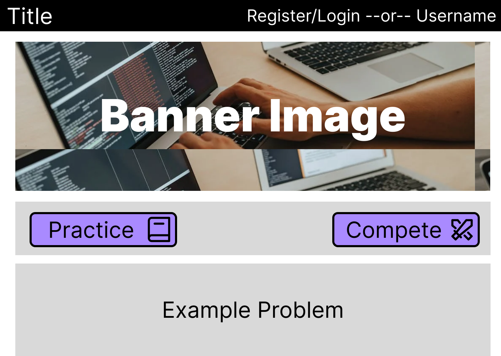
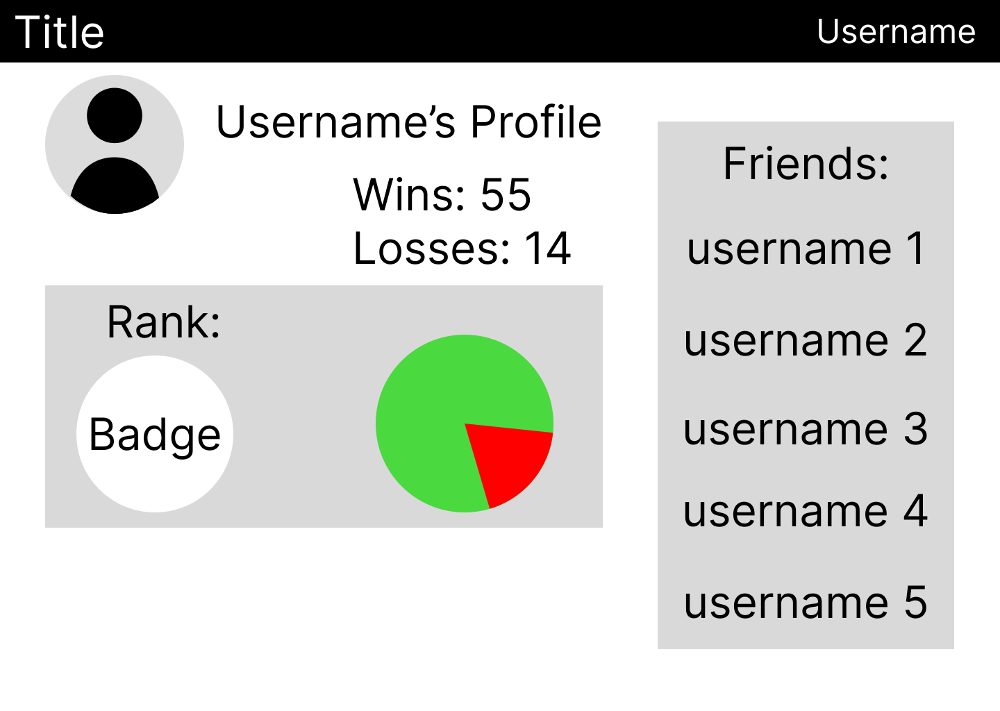
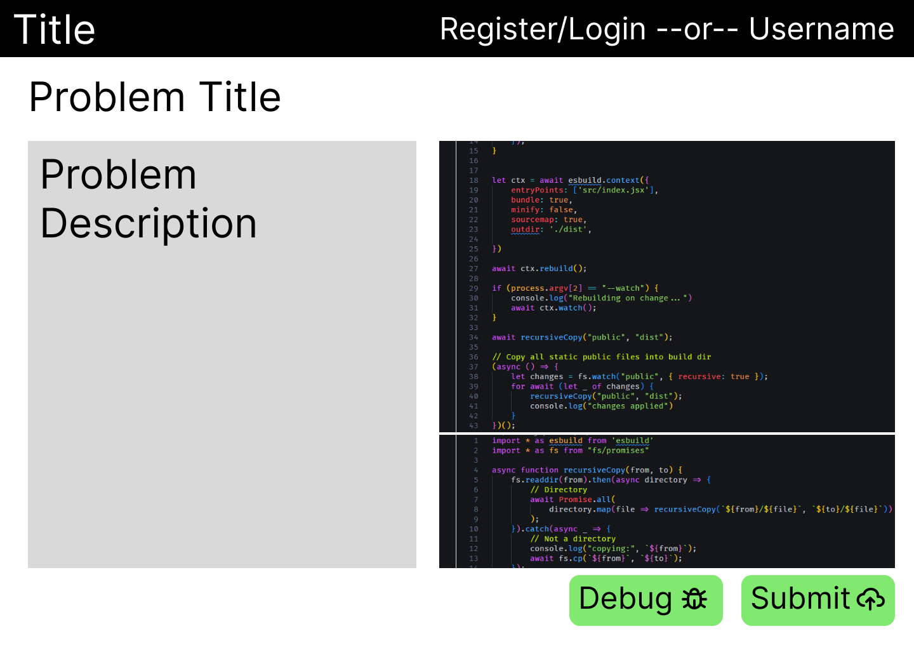
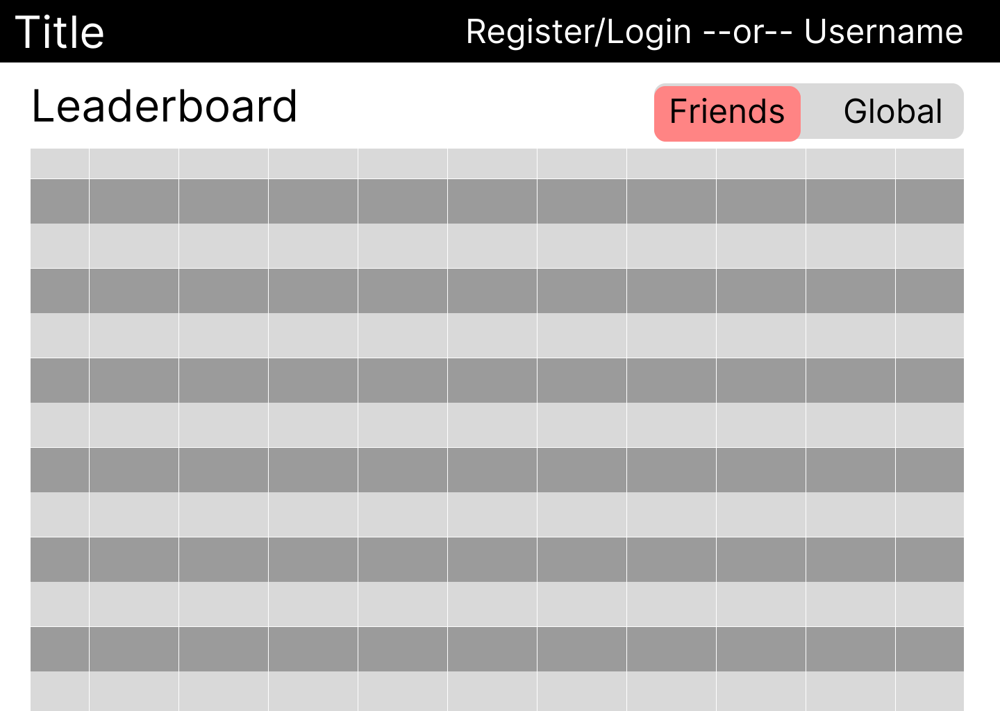

# Project Proposal

---

title:  'Project Proposal'
author:

- Dan Pomerantz, Sam Imberman
- 420-620-DW

---

# Web Development Project Proposal

Please copy this document to final project GitLab repository (**not the proof of concept repo**), in a branch named `proposal`. I will given you my comments in the MR.

(read the tutorials/gitTips.md!)

## **Identification**

---

**Student participant names:**

1. Gabriel Internoscia
2. Noah
3. Robert
4. Alex Vendramin
5. Matthew

The name of your team’s software company: **GNARM Inc.**

Official project name (can be changed later): **Coding League**

Project’s internal codename (cannot be changed later): **League**

---

## **Project summary**

Our project is a web application allowing users to partake in coding challenges, in order to improve and expand their own skills, or compete with others.

Dataset URL: 

[Problemset - Codeforces](https://codeforces.com/problemset/)

## **What makes us unique?**

---

- Competitive ranking system similar to a ELO rating system
- Separate ranks based on different metrics
    - CPU time
    - Memory Usage
    - Lines of code
    - Best practices / Idiomatic code?
- Peer reviewing, Open discussions about problem solutions and suggest alternative methods
    - Learn from others and benefit from the experience of the group
- Friends leaderboard
    - Compete with friends to try and get high scores on specific problems
- Real time coding races using web-sockets (if we have time)

## **User Stories**

---

### **User persona 1**

**Persona description**: Competitive programmer

**Name**: John Doe

**Importance of users corresponding to this persona**: High (power users)

**Broad goal**: I want to show how much smarter I am than others.

User stories:

- As a competitive person, I want to be able to see a list of users who are better than me so that I can improve my score on problems they have done and beat them.
- I want to be able to critique other peoples code to make myself feel superior.

---

### **User persona 2**

**Persona description**: Casual user, learning to code by solving problems.

**Name**: Jane Doe (john’s mom)

**Importance of users corresponding to this persona**: Very important

**Broad goal**: I want to improve my coding skills and stay sharp in my old age.

User stories:

- I want to find programming challenges that will help me learn specific skills.
- I don’t want to always be competitive like my obtuse son, I’d like to be able to program without the pressure of being judged or ranked.

---

### **User persona 3**

**Persona description**: Junior Software Developer 

**Name**: Polly Esther

**Importance of users corresponding to this persona**: Very important 

**Broad goal**: I want to learn from others and get meaningful feedback on my code to improve my own skills.

User stories:

- I want to make sure the way I’m solving this problem is reasonable, but I don’t know anybody who knows the language I’m using to ask.
- I’m trying to learn language X but can’t think of anything to build with it to learn. I wish there was a set of problems that I could try to solve in slowly increasing difficulty to learn.
- I realized I benefited a lot from people helping me as I was learning to code. I wish there was a way I can give back by helping other people learn some of the things I now understand well.

## **Mockups**

---

Main UI:

List of features presented:

- Practice vs Compete problem selection
- Register / Login
- Example problem display

---

Search UI: Practice Search Page

List of features presented:

- Language and type selection
- Difficulty range filter
- Problem display

---

Details page UI (or whatever): User Profile

List of features presented:

- Friends list
- Rank display
- Win / loss ratio

---

Coding Problem page

List of features presented:

- Coding problem
- Answer box
- Debugging / submitting answer code

---

Leaderboard page

List of features presented:

- List of user’s score of the coding problem
- Filter by global or by user’s friend list